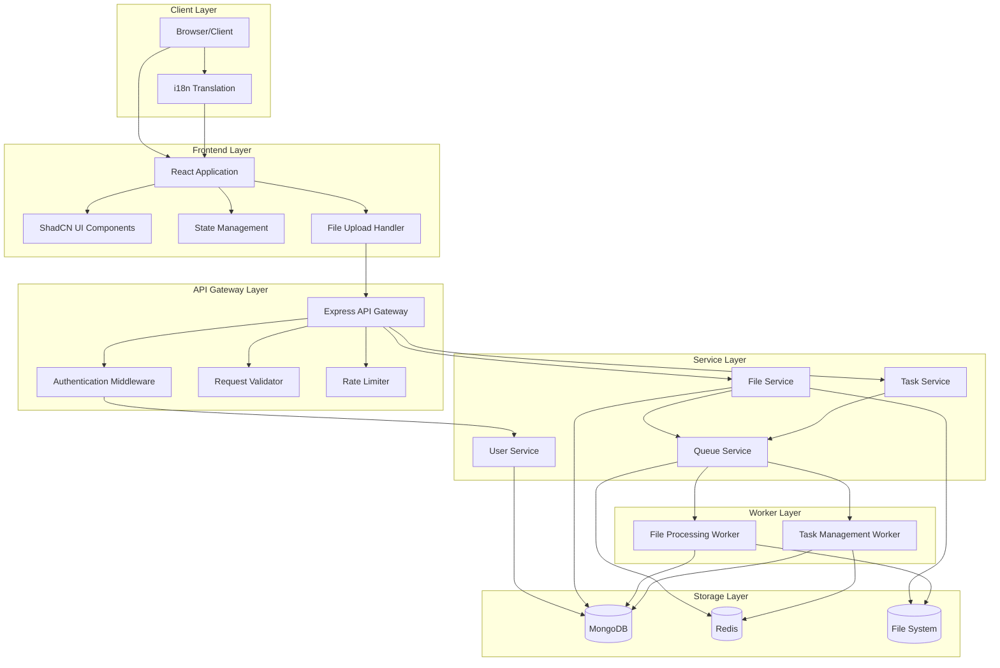
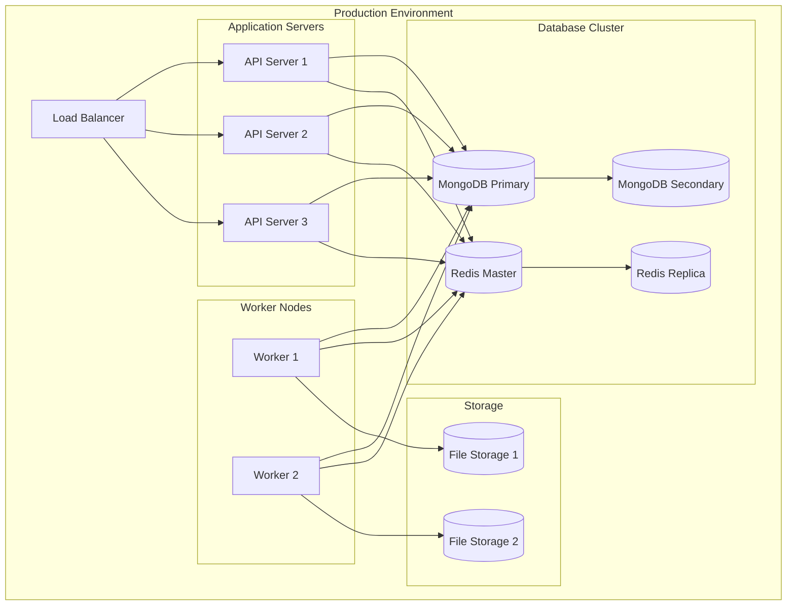

# System Architecture Documentation

## High-Level Architecture Diagram

## Component Details

### 1. Client Layer
- **Browser/Client**: Web interface accessible via modern browsers
- **i18n Translation**: Handles multiple language support
  - Supports: English, Spanish, French, German, Chinese
  - Uses local storage for language preference
  - Dynamic language switching

### 2. Frontend Layer
- **React Application**:
  - Built with Vite for optimal performance
  - Component-based architecture
  - Responsive design
  
- **ShadCN UI Components**:
  - Customized theme system
  - Accessible components
  - Responsive layouts
  
- **State Management**:
  - User authentication state
  - File upload progress
  - Task status monitoring
  
- **File Upload Handler**:
  - Chunked file uploads
  - Progress tracking
  - Retry mechanism
  - Validation

### 3. API Gateway Layer
- **Express API Gateway**:
  - RESTful endpoints
  - CORS configuration
  - Error handling
  
- **Authentication Middleware**:
  - JWT validation
  - Role-based access control
  - Session management
  
- **Request Validator**:
  - Input sanitization
  - Schema validation
  - Type checking
  
- **Rate Limiter**:
  - IP-based limiting
  - Endpoint-specific limits
  - Redis-backed storage

### 4. Service Layer
- **User Service**:
  - User management
  - Authentication
  - Profile management
  
- **File Service**:
  - File operations
  - Metadata management
  - Access control
  
- **Task Service**:
  - Task creation
  - Status tracking
  - Progress monitoring
  
- **Queue Service**:
  - Task queuing
  - Job distribution
  - Retry handling

### 5. Worker Layer
- **File Processing Worker**:
  - Asynchronous file processing
  - Format validation
  - Virus scanning
  - Metadata extraction
  
- **Task Management Worker**:
  - Background job execution
  - Progress updates
  - Error handling

### 6. Storage Layer
- **MongoDB**:
  - User data
  - File metadata
  - Indexes for performance
  
- **Redis**:
  - Task queues
  - Session storage
  - Rate limiting data
  - Cache
  
- **File System**:
  - Hierarchical file storage
  - Backup management
  - Cleanup routines

## Security Measures

1. **Authentication & Authorization**:
   - JWT-based authentication
   - Role-based access control
   - Session management
   - Password hashing (bcrypt)

2. **Data Security**:
   - Input validation
   - XSS prevention
   - CSRF protection
   - SQL injection prevention

3. **File Security**:
   - Virus scanning
   - File type validation
   - Access control lists
   - Encrypted storage

## Scalability Considerations

1. **Horizontal Scaling**:
   - Stateless API design
   - Load balancer ready
   - Worker pool scaling
   - Database replication

2. **Performance Optimization**:
   - Redis caching
   - Database indexing
   - CDN integration
   - Load balancing

3. **Monitoring & Maintenance**:
   - Health checks
   - Performance metrics
   - Error tracking
   - Automated backups

## Deployment Architecture

